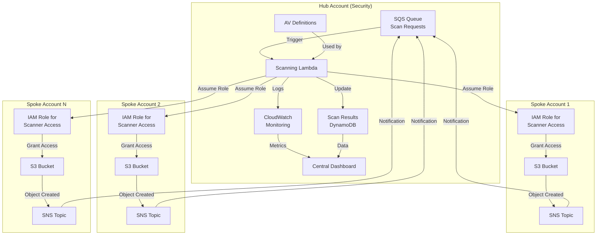
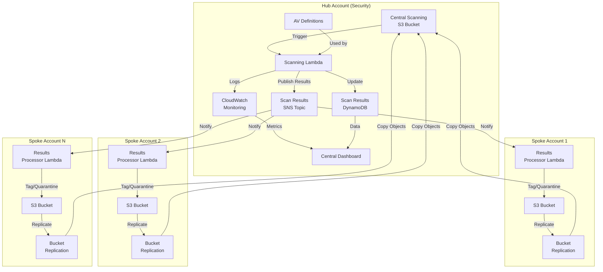
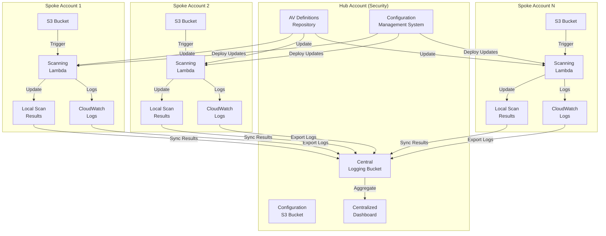
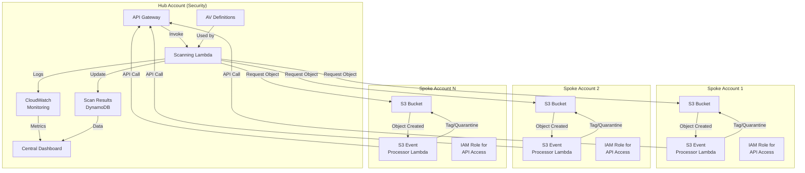
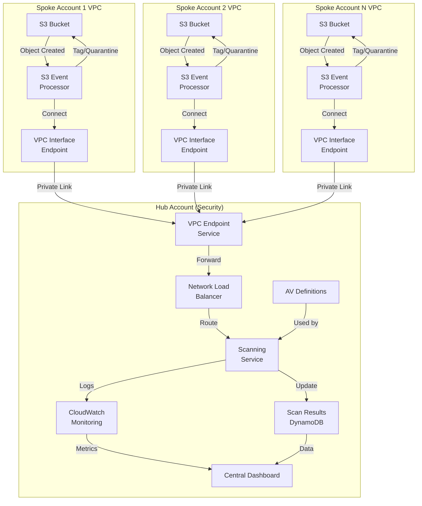
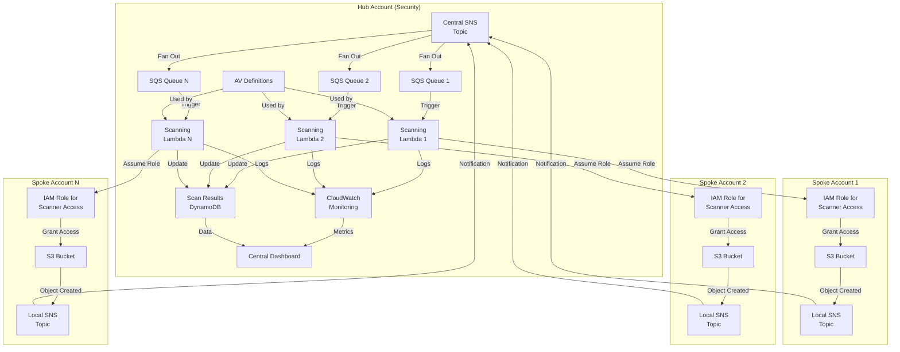

# Comprehensive Comparison of Hub-and-Spoke S3 Bucket AV Scanning Models

## Architectural Options Comparison

| Criteria | Direct Scanning Model | Object Replication Model | Distributed Scanning with Central Management | API Gateway Proxy Model | VPC Endpoint Service Model | SNS Fan-Out Model |
|----------|----------------------|--------------------------|----------------------------------------------|-------------------------|----------------------------|-------------------|
| **Cost - Infrastructure** | Low (single scanning infrastructure) | Medium (scanning infrastructure + replication storage) | High (scanning infrastructure in each account) | Medium (API Gateway + scanning infrastructure) | High (VPC endpoints + NLB + scanning infrastructure) | Low-Medium (SNS + multiple Lambdas) |
| **Cost - Data Transfer** | Low (no object transfer between accounts) | High (all objects transferred to hub account) | None (no cross-account transfer) | Medium (object data transferred via API) | Low (internal AWS network transfer) | Low (no object transfer, just metadata) |
| **Network Efficiency** | High (minimal network usage) | Low (duplicate data across accounts) | High (localized scanning) | Medium (API calls + object data) | Medium (VPC traffic) | High (minimal cross-account traffic) |
| **Throughput** | Medium-High (centrally managed scaling) | Medium (limited by replication performance) | High (distributed processing) | Medium (limited by API Gateway quotas) | Medium-High (limited by VPC endpoint capacity) | High (parallel processing via fan-out) |
| **Scan Latency** | Low (direct access) | High (wait for replication + scan) | Low (local scanning) | Medium (API call overhead) | Medium (VPC routing overhead) | Low-Medium (dependent on Lambda concurrency) |
| **Simplicity of Implementation** | High (standard IAM roles + S3 notifications) | Medium (replication configuration + post-scan actions) | Low (distributed deployment + central mgmt) | Medium (API design + Lambda integration) | Low (VPC design + endpoint configuration) | Medium (SNS configuration + Lambda scaling) |
| **Operational Complexity** | Low (single point of management) | Medium (replication monitoring + storage management) | High (multiple scanning deployments) | Medium (API monitoring + management) | High (VPC + endpoint management) | Medium (SNS + Lambda monitoring) |
| **Security Posture** | Medium-High (limited cross-account permissions) | Medium (objects temporarily stored in hub account) | High (no cross-account permissions) | Medium (API authentication needed) | High (private network connectivity) | Medium-High (limited cross-account permissions) |
| **Scalability (Adding Accounts)** | High (only IAM role needed in new accounts) | Medium (replication setup for each new account) | Low (full deployment in each new account) | High (just API integration needed) | Low-Medium (VPC endpoint setup for each account) | High (just SNS subscription needed) |
| **Compliance Boundary Isolation** | High (objects never leave original account) | Low (objects cross account boundaries) | High (objects never leave original account) | Medium (object data crosses boundaries) | Medium-High (data stays on AWS network) | High (objects never leave original account) |
| **Centralized Reporting** | Easy (all scan results in central account) | Easy (all scans performed centrally) | Medium (requires aggregation from all accounts) | Easy (all API calls logged centrally) | Easy (all scanning centralized) | Easy (all scan results in central account) |
| **Time to Implement** | Low (standardized templates) | Medium (replication + scanning setup) | High (multiple account deployments) | Medium-High (API design + implementation) | High (VPC + endpoint setup in all accounts) | Medium (SNS + Lambda setup) |
| **Resilience** | Medium-High (dependent on hub account) | Medium (dependent on replication + hub account) | High (distributed architecture) | Medium (API Gateway + hub account dependencies) | Medium (VPC endpoint service availability) | High (SNS reliability + multiple Lambdas) |

## Architectural Diagrams

### 1. Direct Scanning Model

### 2. Object Replication Model

### 3. Distributed Scanning with Central Management

### 4. API Gateway Proxy Model

### 5. VPC Endpoint Service Model

### 6. SNS Fan-Out Model

## Detailed Analysis of Each Model

### 1. Direct Scanning Model
**Advantages:**
- No data duplication or transfer costs
- Simple standardized deployment across accounts
- Centralized management and reporting
- Quick scan results (no replication delay)
- Low operational overhead

**Disadvantages:**
- Requires cross-account IAM permissions
- Hub account Lambda function needs network access to all buckets
- Single point of failure in hub account
- Potential Lambda concurrency limits if not properly configured

### 2. Object Replication Model
**Advantages:**
- Full isolation of scanning infrastructure
- Simpler scanning logic (all objects in one place)
- Can retain copy of infected files for forensics
- Can batch process scans for efficiency

**Disadvantages:**
- High data transfer and storage costs
- Latency between upload and scan completion
- Complex replication configuration and maintenance
- Double storage costs for all objects during scanning
- More challenging to scale with large file volumes

### 3. Distributed Scanning with Central Management
**Advantages:**
- No cross-account permissions required
- Fastest scanning response time
- Highest data locality and isolation
- No central bottleneck for scanning throughput

**Disadvantages:**
- Highest implementation complexity
- Most expensive to operate (infrastructure in every account)
- Requires synchronization of AV definitions across accounts
- Complex to maintain consistency across environments
- Most difficult to update or modify across all accounts

### 4. API Gateway Proxy Model
**Advantages:**
- Well-defined interface between accounts
- More granular control over access
- Can leverage API Gateway features (throttling, caching)
- Cleaner separation of scanning logic

**Disadvantages:**
- API Gateway costs can be significant at scale
- Additional latency from API calls
- More complex error handling
- Potential API Gateway limits and throttling
- Higher development complexity

### 5. VPC Endpoint Service Model
**Advantages:**
- Most secure network communication
- Traffic never traverses public internet
- Can use non-serverless scanning engines
- Better for very large files or specialized scanning needs
- More suitable for compliance-sensitive environments

**Disadvantages:**
- Highest network configuration complexity
- Most expensive network infrastructure
- Requires VPC in each account
- Complex to troubleshoot network issues
- Higher operational costs for VPC endpoints

### 6. SNS Fan-Out Model
**Advantages:**
- Highly scalable parallel processing
- Better handling of scan request bursts
- Can segregate scanning by file type or sensitivity
- Good fault isolation (failure of one Lambda doesn't affect others)

**Disadvantages:**
- More complex SNS/SQS configuration
- Potential message duplication issues
- More challenging to debug scan failures
- Higher messaging costs at scale
- More complex Lambda concurrency management

## Recommendation Summary

Given the state government agency's priority for simplicity and ease of implementation, I recommend the **Direct Scanning Model** as the best balance between operational simplicity and cost-effectiveness for a 70-account deployment. This approach minimizes data transfer costs, centralizes management, and provides a straightforward implementation path while maintaining adequate security controls.

For implementation, standardize a cross-account IAM role template that can be deployed via StackSets to all accounts, configure S3 event notifications to trigger scanning requests, and build a centralized Lambda-based scanning infrastructure in a dedicated security account. This approach can be deployed incrementally and provides a clear path to scale as needed.
