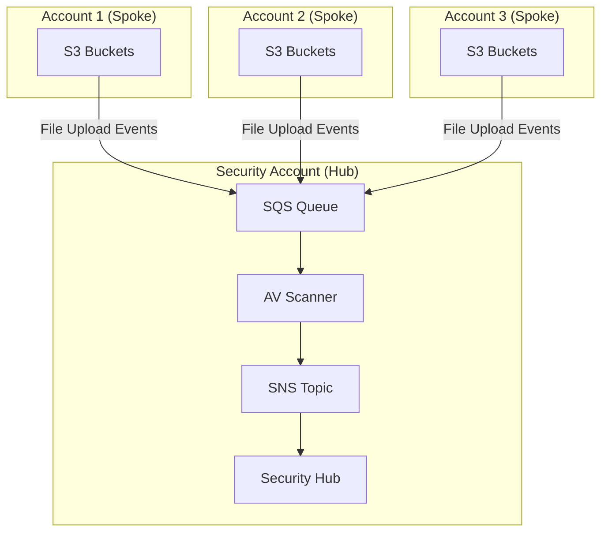
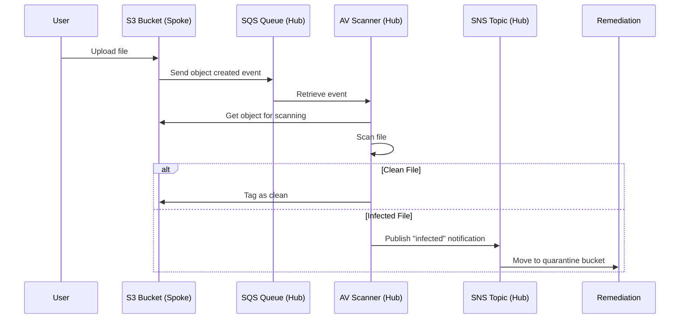
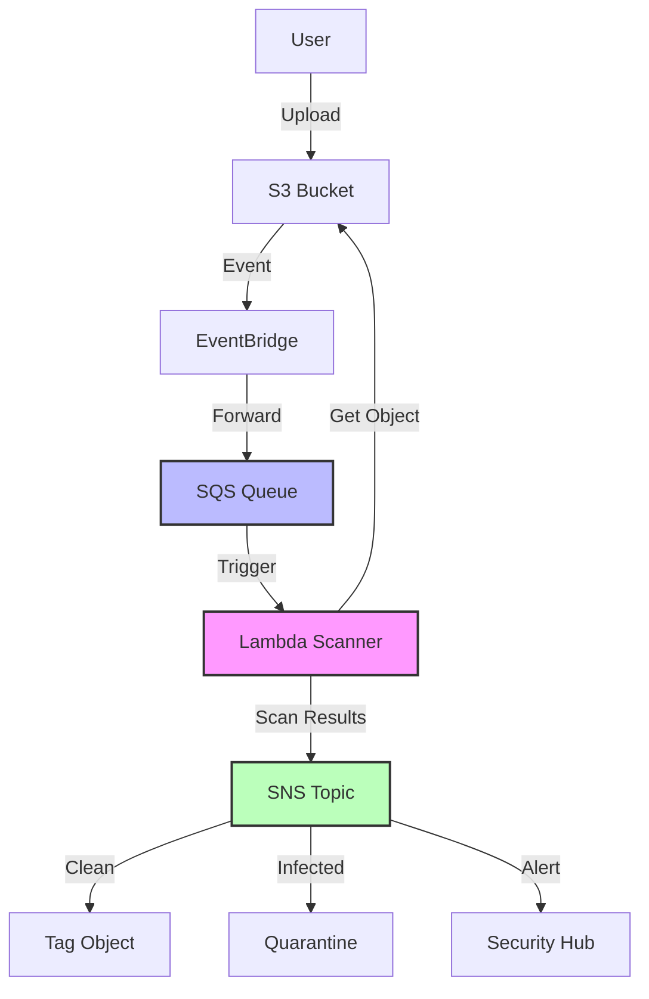

# Simplified S3 Antivirus Scanning on AWS: Hub-and-Spoke Model

## Ready-Made Solutions Available

Yes, there are simpler solutions available:

1. **AWS GuardDuty Malware Protection** - Built-in AWS service that can scan S3 objects with minimal setup
2. **AWS Marketplace Solutions**:
   - **Cloud Storage Security** - Turnkey S3 antivirus solution
   - **Trend Micro Cloud One** - Complete file security solution for S3

These options require less custom development but may have higher subscription costs.

## Simplified Architecture Overview

## Key Components

1.  **Hub Account**: Central security account that manages scanning
    
    -   SQS queue receives all bucket events
    -   Scanners run here (Lambda or EC2)
    -   Security Hub collects findings
2.  **Spoke Accounts**: Regular AWS accounts with S3 buckets
    
    -   Only need IAM roles for cross-account access
    -   S3 buckets configured to send events to hub
3.  **Scanning Process**: Asynchronous, near real-time scanning
    

## Simplified Workflow

## Pragmatic Implementation

### Quick Setup Guide

1.  **Create Security Hub Account**:
    
    -   Deploy central components (SQS, SNS, Lambda/EC2 scanners)
    -   Set up Security Hub for findings
2.  **In Each Spoke Account**:
    
    -   Create IAM role with S3 read permissions
    -   Configure EventBridge rules to forward S3 events to central SQS
3.  **Deploy Scanning Logic**:
    
    -   Use AWS Lambda with ClamAV for simplicity (handles most file sizes up to 500MB)
    -   For larger files or higher throughput, use EC2 with auto-scaling
4.  **Configure Notifications & Quarantine**:
    
    -   Set up SNS topic for scan results
    -   Create Lambda functions for remediation (tagging, quarantine)

## Cost-Effective Optimizations

1.  **Selective Scanning**:
    
    -   Only scan high-risk buckets - tag buckets with `scan:true`
    -   Skip scanning log files, backups, etc.
2.  **Use Lambda for Simplicity**:
    
    -   More cost-effective for low-to-medium volume
    -   No need to manage infrastructure
3.  **Regional Deployment**:
    
    -   Keep scanning in same region as S3 buckets to avoid data transfer costs

## Trade-offs

| Aspect | Simple Approach | Full Security Approach |
| --- | --- | --- |
| Setup | Lambda + ClamAV | Multi-engine EC2 cluster |
| Cost | Lower, pay-per-scan | Higher, always-on capacity |
| Detection Rate | Good (single engine) | Better (multi-engine) |
| Latency | Seconds to minutes | Near real-time |
| Maintenance | Minimal | Regular updates required |

This simplified approach prioritizes ease of implementation while still providing solid protection against common malware threats.
